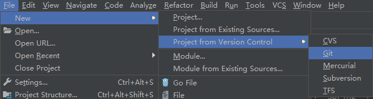
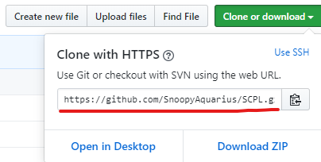
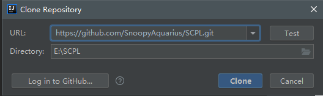
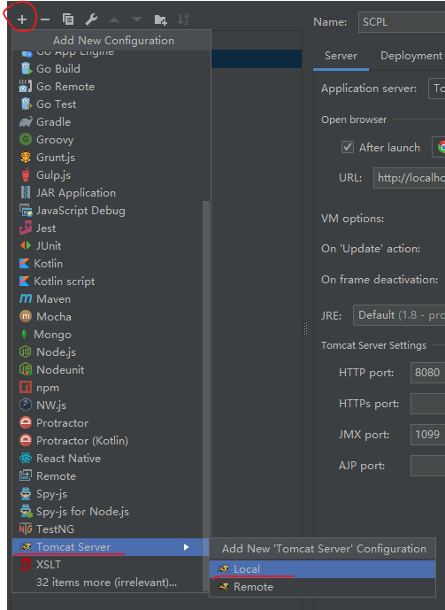
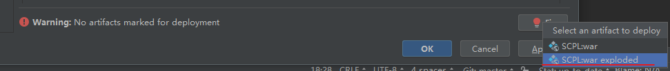

# SCPL 校园信息平台系统

项目使用IDEA构建  
后端使用`Struts2` + `Spring` + `Mybatis` + `Maven`，前端使用`jquery` + `bootstrap`  
支持`IE10+`

## 环境搭建
- **1** 数据库搭建
    + **1.1**  导入sql/xy.sql  
    + **1.2**  导入sql/shm.sql
- **2** 项目搭建
    + **2.1**  File -> Project from Version Control -> Git  
    
    + **2.2**  导入该项目的URL，设置好项目存放的路径  
      
    
    + **2.3**  等待项目indexing
    + **2.4**  配置Tomcat  
    
    